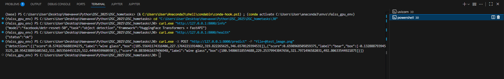
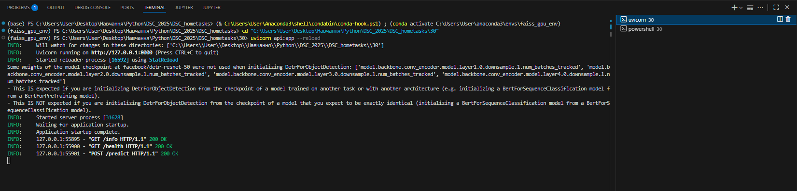

# Object Detection API with DETR and FastAPI

## Overview

This project is a simple web service for object detection in images. It uses the DETR (DEtection TRansformer) model (facebook/detr-resnet-50) from the Hugging Face library and is deployed as a REST API using the FastAPI framework.

The service provides several endpoints to check its health, get information about the model, and perform object detection on a user-provided image.

## Deployment Info

The application is deployed as a web server using Uvicorn. To run the server, use the following command from the project's root directory:

`uvicorn api:app --reload`

api: refers to the Python file api.py.

app: refers to the FastAPI instance app = FastAPI(...) inside the file.

--reload: enables auto-reloading the server when code changes are detected (useful for development).

The API will be available at http://127.0.0.1:8000.

## Installation Instruction

Follow these steps to set up and run the project locally.

Clone the repository (or download the files):

```bash
git clone <your-repo-url>
cd <your-project-folder>
```

Create and activate a virtual environment (recommended):

```bash
python -m venv venv
.\venv\Scripts\activate
```

Install the required dependencies:
Make sure you have the requirements.txt file in your project directory.

`pip install -r requirements.txt`

## Modeling Info

**Model:** facebook/detr-resnet-50

**Description:** This is a DETR (DEtection TRansformer) model with a ResNet-50 backbone. It was pre-trained on the COCO 2017 dataset for object detection.

**Framework:** The model is loaded and used via the transformers library from Hugging Face.

**Task:** Object Detection. The model identifies objects in an image and returns their bounding boxes and class labels (e.g., "cat", "wine glass").

## Interface Description

The API provides the following endpoints:

1. ### Health Check

   Endpoint: _GET /health_

   Description: A simple endpoint to verify that the service is running.

   Input: None.

   Output: A JSON object indicating the status.

   ```json
   {
     "status": "ok"
   }
   ```

2. ### Model Information

   Endpoint: _GET /info_

   Description: Provides basic information about the model and framework used.

   Input: None.

   Output: A JSON object with model details.

   ```json
   {
     "model": "facebook/detr-resnet-50",
     "task": "object detection",
     "framework": "HuggingFace Transformers + FastAPI"
   }
   ```

3. ### Perform Prediction

   Endpoint: _POST /predict_

   Description: Accepts an image file and returns a list of detected objects.

   Input:
   file: An image file (multipart/form-data). Supported formats include JPEG, PNG, etc.

   Output: A JSON object containing a list of detections. Each detection includes the confidence score, label, and bounding box coordinates [x_min, y_min, x_max, y_max].

   ```json
   {
     "detections": [
       {
         "score": 0.8741676688194275,
         "label": "wine glass",
         "box": [
           105.5941162109375, 227.3742218017578, 203.0228271484375,
           346.6570129394531
         ]
       }
     ]
   }
   ```

   Example of Processes
   Here are examples of communication with the API using curl.

4. ### Starting the server:
   
5. ### Making requests to the endpoints:

   

   Example curl commands:
   Health Check:

   `curl.exe http://127.0.0.1:8000/health`

   Info:

   `curl.exe http://127.0.0.1:8000/info`

   Prediction:
   (Assuming you have an image named test_image.png in the current directory)

   `curl.exe -X POST "http://127.0.0.1:8000/predict" -F "file=@test_image.png"`
