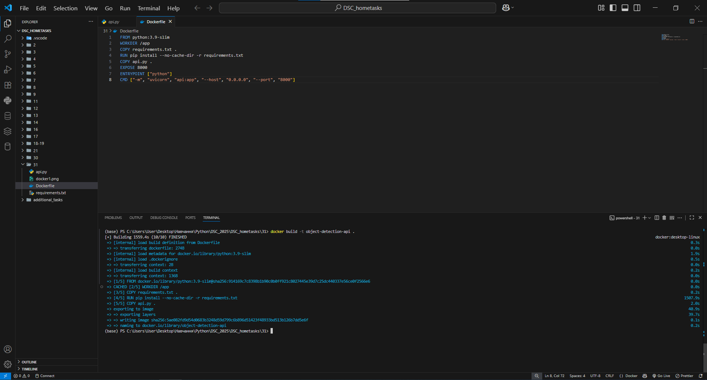
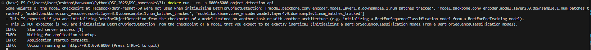
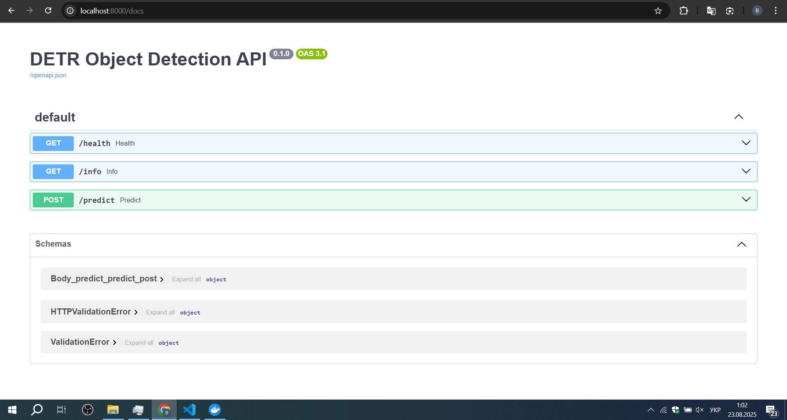
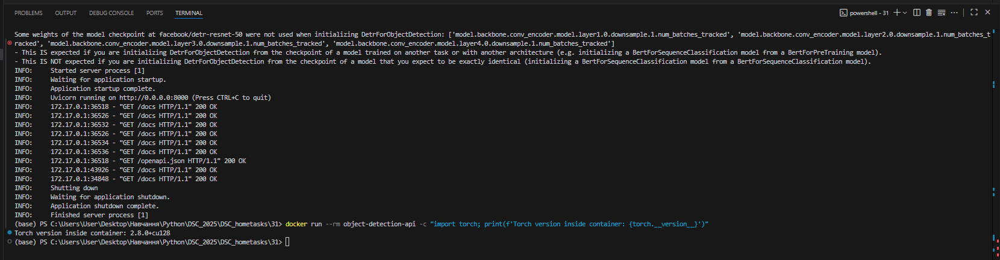

# Docker Deployment for an Object Detection API

This project demonstrates the deployment of a FastAPI web application for object detection using a pre-trained DETR model (facebook/detr-resnet-50). The application is containerized using Docker, ensuring an easy and reproducible deployment process.

## Task Requirements

- Create a Docker deployment for a web application.
- Make it possible to run any script inside the container by providing arguments to the docker run command.
- Provide the Dockerfile and screenshots that showcase each step of the process.

## Prerequisites

Docker Desktop must be installed and running.

## Project Structure

```code
.
├── api.py
├── docker1.png
├── docker2.png
├── docker3.png
├── docker4.png
├── Dockerfile
├── README.md
├── requirements.txt

```

## Step-by-Step Guide

- ### **Build the Docker Image**
  Navigate to the project's root directory in your terminal and execute the command below.
  This command will read the Dockerfile and build an image containing all dependencies and your application code.

```
docker build -t object-detection-api .
```

- ### **Run the Web Application**

To run the container in detached mode and make the API available on port 8000, execute:

```
docker run -d -p 8000:8000 --name my-api-container object-detection-api
```

- ### **Access the API**

Once the container is running successfully, open your browser and navigate to the following address to access the interactive API documentation:

http://localhost:8000/docs

## Task Completion Showcase

Below are the screenshots that confirm the completion of all task requirements.

### Task 1: Create and Run the Docker Deployment

#### Image Build Process

This screenshot shows the successful execution of the docker build command, which creates the object-detection-api image.


#### Running Container Logs

After starting the container, the logs show that the model was loaded successfully and the Uvicorn web server has started.


#### Accessing the Running API via Browser

The web application is successfully deployed and accessible at localhost:8000/docs.


### Task 2: Running an Arbitrary Command

Execution of a Custom Command
Thanks to the ENTRYPOINT and CMD configuration in the Dockerfile, the default command can be overridden.

The screenshot below shows the execution of arbitrary Python code to print the torch version inside the container.

Project File Contents

## Dockerfile

```
Dockerfile

# --- Stage 1: Base Image ---

FROM python:3.9-slim

# --- Stage 2: Set Working Directory ---

WORKDIR /app

# --- Stage 3: Install Dependencies ---

COPY requirements.txt .
RUN pip install --no-cache-dir -r requirements.txt

# --- Stage 4: Copy Application Code ---

COPY api.py .

# --- Stage 5: Expose Port ---

EXPOSE 8000

# --- Stage 6: Configure Entrypoint and CMD ---
ENTRYPOINT ["python"]
CMD ["-m", "uvicorn", "api:app", "--host", "0.0.0.0", "--port", "8000"]
```

## requirements.txt

```
fastapi
uvicorn[standard]
torch
transformers
Pillow
requests
python-multipart
timm
```
